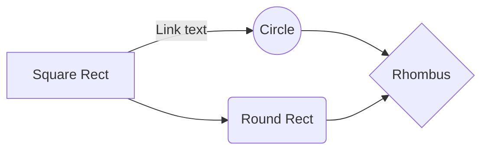

# Introduction

This _post_ is **just** a show case for all the possibilities of my "nearly" static site generator.

Just testing mermaid block fences and wondering how it's working.



## Code Snippets

Want still to support normal snippet

```ruby

puts "we are done here"

```

## Code Snippet python

```python

if debug:
    print("we are done here")

```

# Conclusion

That's cool no ?
