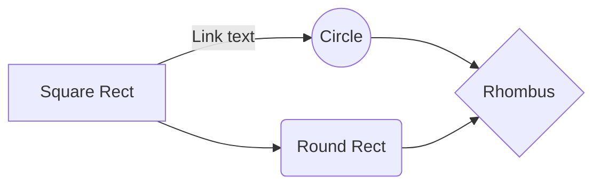

Just testing and wondering how it's working.


```mermaid
graph LR
    A[Square Rect] -- Link text --> B((Circle))
    A --> C(Round Rect)
    B --> D{Rhombus}
    C --> D
```

Want still to support normal snippet

```ruby

puts "we are done here"

```
